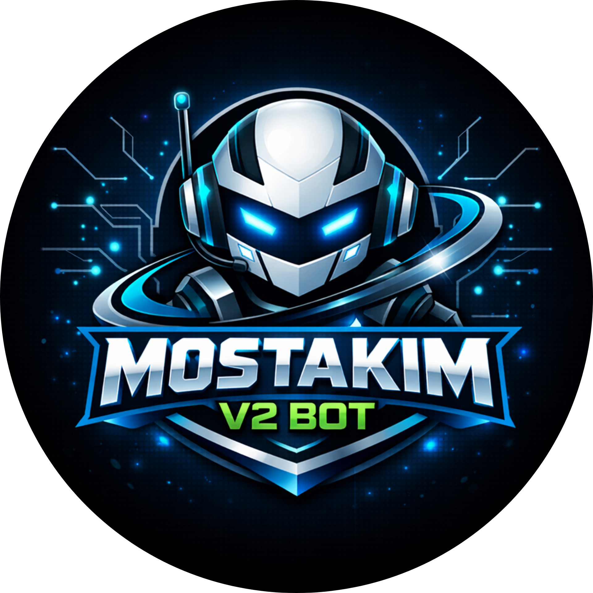

  

  

-----------

 
   

 

-----------

-----------

-----------

<!-- Snake Game Repo View -->

  

-----------

#### `🚀 Aspiring Web Developer | HTML Learner & Chat bot developer`

---

## 👨‍💻 `About Me`

- 🔭 **Current Focus:** I am currently diving deep into **HTML5** to understand the core structure of the web.

- 🌱 **Learning Path:** Mastering semantic tags, forms, and building accessible web layouts.

- 🎯 **Future Goals:** My next step is to start learning **CSS** to bring my web structures to life with beautiful designs.

- 💬 **Ask me about:** Basic web structure or my learning journey so far!

---

## 🛠 Skills I'm Building

  <!-- HTML -->
  

  <!-- CSS -->
  

  <!-- JavaScript -->
  

  <!-- React -->
  

  <!-- Node.js -->
  

  <!-- npm -->
  

  <!-- Python -->
  

  <!-- Express -->
  

  <!-- MongoDB -->
  

  <!-- Firebase -->
  

  <!-- Git -->
  

  <!-- GitHub -->
  

  <!-- Custom Bot -->
  

-----------

## `🎭 GitHub Badges`

---

## `📊 My GitHub Stats`

 

-----------

  

-----------

## `📫 Let's Connect`

<i>"Let’s build something awesome together"</i>

-----------

_____
